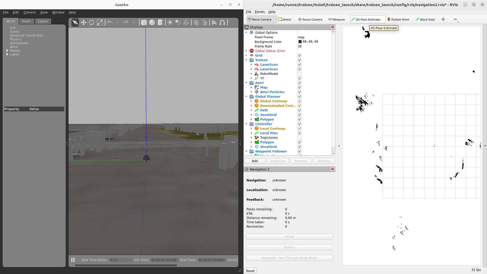
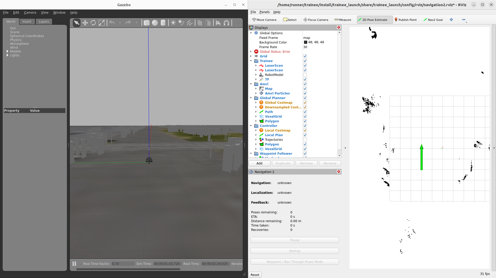
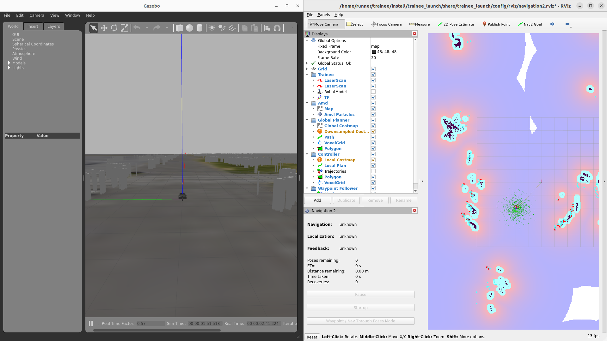
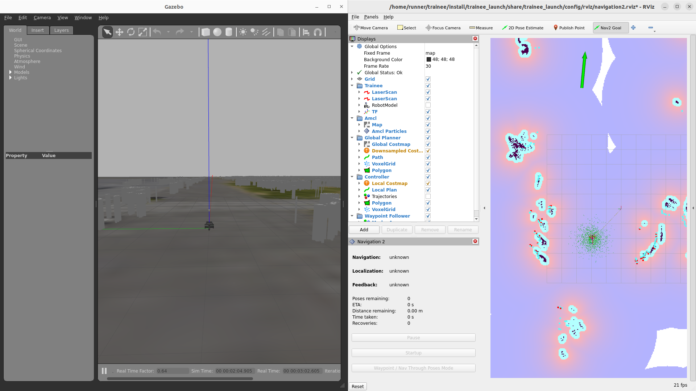
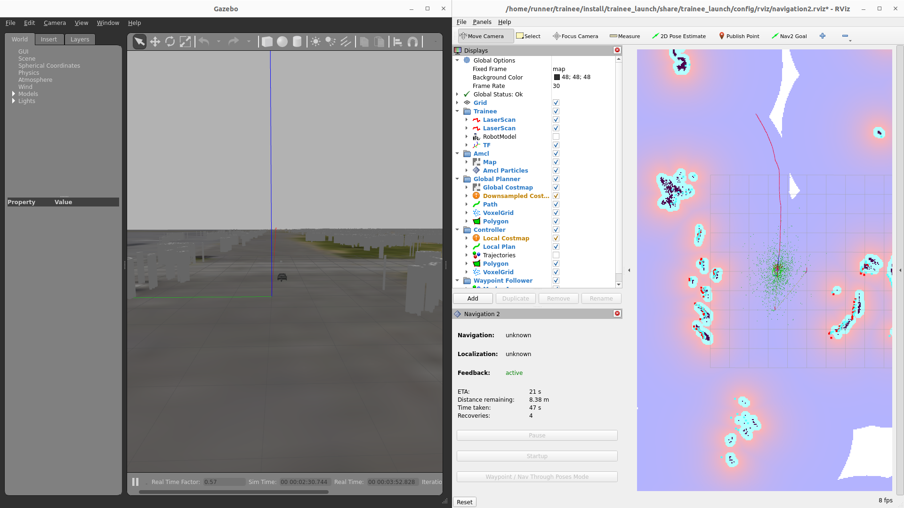

# ROS 2のシミュレータ & トレーニーでNavigationをしよう！

## 概要

シミュレータ内でNavigationをする方法説明する。

## Navigationすっぞ

* Navigationに必要なものを起動

```
ros2 launch raspicat_map2gazebo raspicat_tsukuba2023_world.launch rviz:=false
ros2 launch trainee_launch pointcloud_to_laserscan.launch.xml
ros2 launch trainee_launch navigation2.launch.xml
ros2 service call /motor_power std_srvs/SetBool '{data: true}'
```

* Navigation実行手順

まずはじめに、地図上のどこにいるのか初期位置を置く必要がある。  
次に目指したい場所にゴールを置くことでNavigationがはじまる。

1. 初期位置を置く `2D Pose Estimate`を使います
<center><a href="../../../images/trainee_navigation_initial_pose.png"></a>
</center>

2. 置きたい位置に置く　長押ししながらマウスを動かすと位置と向きを指定することが可能
<center><a href="../../../images/trainee_navigation_initial_pose_set.png"></a>
</center>

3. 上手く置けるとこんな感じになります Navigationが位置を読み込みます
<center><a href="../../../images/trainee_navigation_initial_pose_set_done.png"></a>
</center>

4. ゴール位置を置く `Nav2 Goal`を使います
<center><a href="../../../images/trainee_navigation_nav2_goal.png"></a>
</center>

5. 置きたい位置に置く　長押ししながらマウスを動かすと位置と向きを指定することが可能
<center><a href="../../../images/trainee_navigation_nav2_goal_set.png"></a>
</center>

6. 上手く置けるとこんな感じになります Navigationがはじまります
<center><a href="../../../images/trainee_navigation_nav2_goal_set_done.png"></a>
</center>