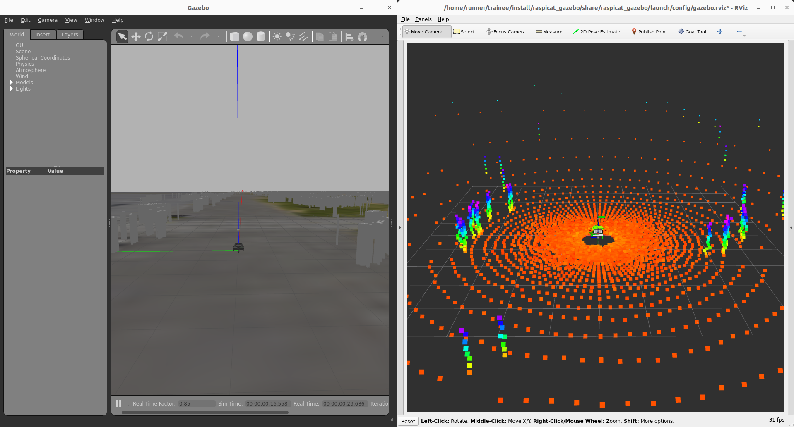
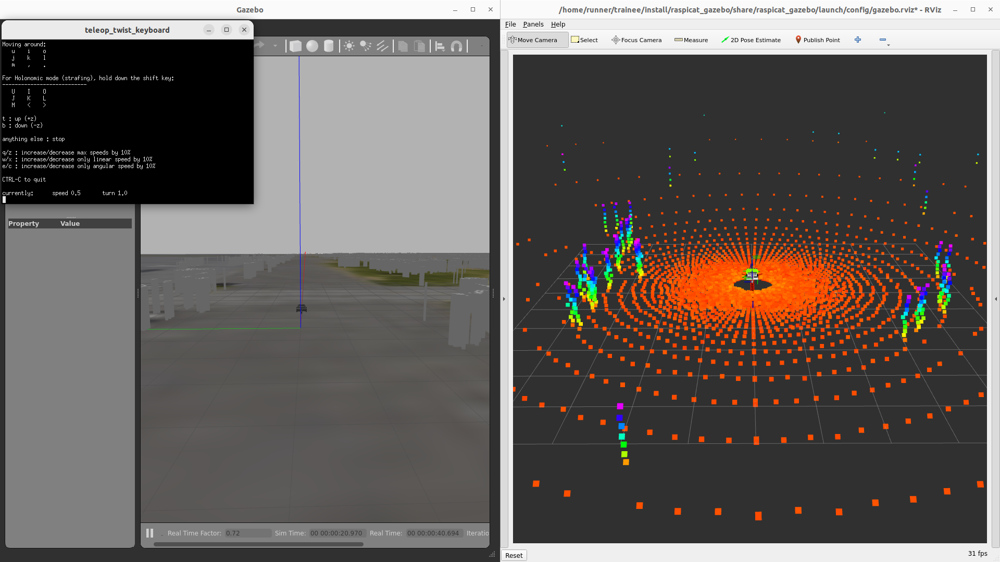

# ROS 2のシミュレータでトレーニーを動かそう！

## 概要

ソフトウェアの開発をするために、シミュレータなどの使用方法について説明する

## シミュレータの起動

### Dockerのインストール（終わってる人は飛ばしてください）

``` sh
sudo apt install docker.io
sudo gpasswd -a $USER docker
sudo reboot
```

### GUIを使用するためにXサーバへのアクセス許可

``` sh
xhost +local:docker
```

### Docker Imageの更新

``` sh
docker pull ghcr.io/shinsotsu-tsukuba-challenger/trainee:humble
```

### コンテナの立ち上げ

``` sh
docker run --rm -it \
           -u $(id -u):$(id -g) \
           --privileged \
           --net=host \
           --ipc=host \
           --env="DISPLAY=$DISPLAY" \
           --mount type=bind,source=/dev/input,target=/dev/input \
           --mount type=bind,source=/home/$USER/.ssh,target=/home/runner/.ssh \
           --mount type=bind,source=/home/$USER/.gitconfig,target=/home/$USER/.gitconfig \
           --mount type=bind,source=/usr/share/zoneinfo/Asia/Tokyo,target=/etc/localtime \
           --name trainee \
           ghcr.io/shinsotsu-tsukuba-challenger/trainee:humble
```

### シミュレータの立ち上げ

!!! info
    勝手にWindowが分割されます（されなかったらissue投げて！）

``` sh
ros2 launch raspicat_map2gazebo raspicat_tsukuba2023_world.launch 
```

<center><a href="../../../images/trainee_sim.png"></a>
</center>

### トレーニーを動かそう！

teleop_twist_keyboardというwindowが立ち上がるので、そこでiキーを押すと  
シミュレータ内のロボットが前進します。

```
ros2 launch raspicat_map2gazebo raspicat_tsukuba2023_world.launch
ros2 launch raspicat_bringup teleop.launch.py teleop:=key
ros2 service call /motor_power std_srvs/SetBool '{data: true}'
```

<center><a href="../../../images/trainee_sim_teleop.png"></a>
</center>