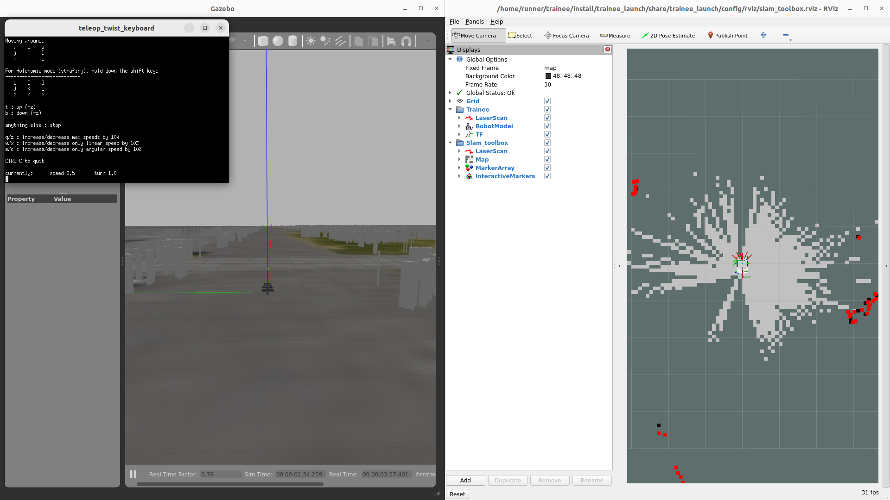

# ROS 2のシミュレータ & トレーニーでSLAMをしよう！

## 概要

シミュレータ内でSLAMをする方法説明する。

## SLAMすっぞ

* SLAMをするために必要なものを起動

```
ros2 launch raspicat_map2gazebo raspicat_tsukuba2023_world.launch rviz:=false
ros2 launch trainee_launch pointcloud_to_laserscan.launch.xml
ros2 launch trainee_launch slam_toolbox.launch.xml
ros2 launch raspicat_bringup teleop.launch.py teleop:=key
ros2 service call /motor_power std_srvs/SetBool '{data: true}'
```

* マップを保存する場合
```
ros2 launch trainee_launch map_save.launch.xml map_name:=map
```

<center><a href="../../../images/trainee_slam.png"></a>
</center>